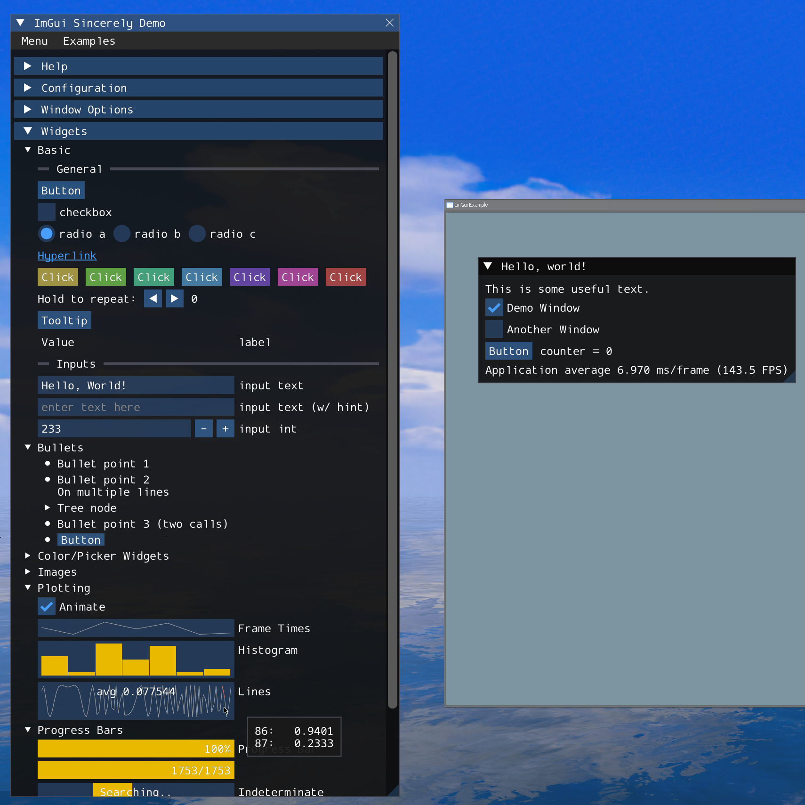

# ImGui Sincerely

> "Give someone state and they'll have a bug one day, but teach them how to represent state in two separate locations that have to be kept in sync and they'll have bugs for a lifetime." - ryg

## Progress

_This image may be outdated!_ 

| Subsystems | Stage                            |
| ---------- | -------------------------------- |
| Fonts(ttf) | Completed, syncing with `main`   |
| Fonts(otf) | Not planned                      |
| Viewports  | Completed, syncing with `docking`|
| Windows    | WIP                              |
| Docking    | Maybe soon                       |
| Widgets    | WIP                              |
| Backends   | Currently only have GMod backend |

Loading [FreeType](https://github.com/freetype/freetype) fonts and `Docking` might be too advanced for GMod/Games that enable Lua scripting. I don't think people need that. And they take a lot of time to re-write in Lua so anybody can resort to real binary modules!

### Notes

Roadmap and task list: [TODO](misc/TODO.md)

Things to pay attention to: [PORT](misc/PORT.md)

Please refer to official Dear ImGui docs or src code comments for documentation!

### How to Try it in GMOD?

1. Clone this project into your GMod `addons` folder
2. Create a singleplayer or multiplayer game
3. Run `imgui_test` command in engine console
4. You can also write your own test scripts and run them!

### My Development Platform

GMod: `x86-64 branch` with `LuaJIT 2.1.0-beta3`, `Lua 5.1`.

The core code(code except backend ones) in [lua/](lua) don't and shouldn't use anything that is exclusive in GMod Lua.

## Primary Goal

Implementing a Dear ImGui clone in **pure Lua**.

## Credits

Thanks to [Dear ImGui](https://github.com/ocornut/imgui)!

References:

- [GitSparTV's LuaJIT Benchmarks](https://gitspartv.github.io/LuaJIT-Benchmarks/)
- [Garry's Mod Wiki](https://wiki.facepunch.com/gmod/)
- [Jaffies's paint lib](https://github.com/Jaffies/paint)
- [Valve Developer Wiki](https://developer.valvesoftware.com/wiki/Main_Page)
- [handsomematt's 3d2d-vgui](https://github.com/handsomematt/3d2d-vgui)
- [TomDotBat's ui3d2d](https://github.com/TomDotBat/ui3d2d)

Previous Attempts at immediate-mode UIs in GMod:

- [wyozi's *imgui*](https://github.com/wyozi-gmod/imgui)
- [Artemking4's fun-project-gmod/*imgui*](https://github.com/fun-project-gmod/imgui)

AIs:

- [DeepSeek](https://www.deepseek.com/)
- [KIMI K2 Thinking](https://www.kimi.com/)
- [TRAE](https://www.trae.ai/)

for helping me avoid those areas involving a lot of repeatitive work!
